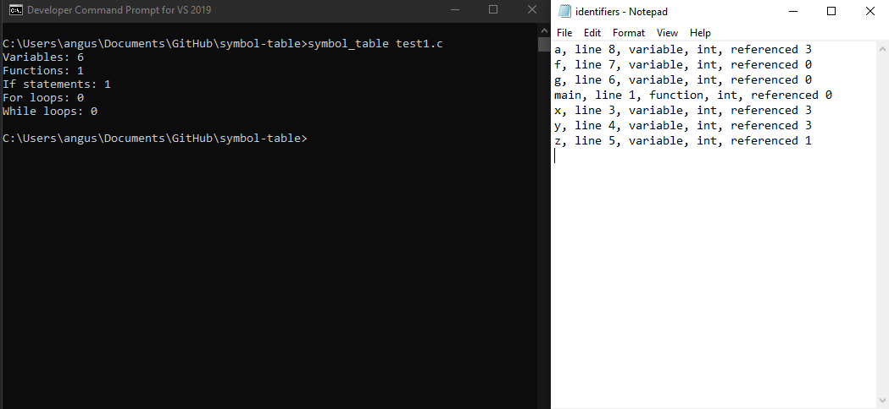

# Symbol Table
 C++ application that reads in .c files containing a C language program. Then records information in a Binary Search Tree such as the number of variables, functions and loops in the program.

	Developer Command Prompt for VS 2019 is used for building 

[Learn More](https://docs.microsoft.com/en-us/visualstudio/ide/reference/command-prompt-powershell?view=vs-2019)

Contents
- [Symbol Table](#symbol-table)
  - [How to build](#how-to-build)
  - [How to clean](#how-to-clean)
  - [Running the app](#running-the-app)
  - [Screenshots](#screenshots)

## How to build

See `Makefile` for the build script.

Once in the project's directory from Microsoft Compiler, simply run `nmake build`.

This will generate the executable called `symbol_table.exe`.

```
nmake build
```

## How to clean

If you need to delete the executable and object code at any time, `nmake clean` can be used. Please remember to build again before trying to run the application.

```
nmake clean
```
## Running the app

Once built, Symbol Table can be ran with Microsoft Compiler CLI. Symbol Table requires one command line argument to be ran successfully:

• `filename.c` specifies the input file you wish to read from. 

Input files are currently limited to either `test1.c`, `test2.c`, `test3.c` or `test4.c`. These could be extended by adding new .c files into the `/src` directory.

Example valid test1.c run command:
```
symbol_table test1.c
```
This will output data to `console` detailing the number of variables, functions, if statements, for loops and while loops.

In the `/out` directory a .txt file called `identifiers.txt` will also be created.

## Screenshots
